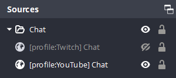

# OBS PerProfile Sources

Script for [OBS](https://obsproject.com/) that allows showing and hiding scene elements (sources) based on the currently
selected [profile](https://obsproject.com/wiki/Profiles-And-Scene-Collections).

## How to use

1. Download the script from the [releases](https://github.com/Susko3/obs-PerProfile-sources/releases/latest) page
2. Add it to OBS using `Tools` → `Scripts` (make sure you have Python Settings properly set up)
3. [Optional] Configure the `Regex Pattern` in script settings (hover over the `?` to see examples)
4. Add `[profile:Profile Name]` to each source you want to show only when that profile is selected

## Example setup:

With this setup, there are two profiles: `YouTube` and `Twitch`. When changing profiles, the appropriate chat will be
shown.

## Advanced usage

You can put multiple profiles on one item, anywhere in the name.  
Example: `Chat [profile:YouTube] [profile:Twitch]` would show when _either_ the `YouTube` or `Twitch` profile is
selected, but not when `Local recording` is.

This script also works with groups and scenes-as-sources for more complex scenarios.

## Notes

Source visibility is updated when the profile or scene changes. So if you are adding/renaming sources and their
visibility isn't updating, change the scene back and forth.

## Acknowledgements

Thanks to [Circus](https://twitter.com/vtcircus) for the idea!